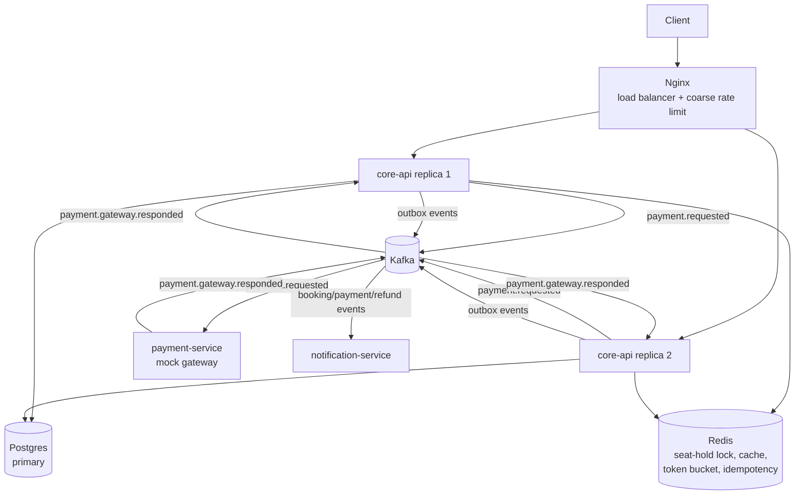

# High-Level Design

This is the top-level narrative; it cross-references
[docs/LLD.md](LLD.md) and [docs/adr](adr) for implementation depth rather
than repeating it. Read this first, then the ADR for whichever decision
you want to go deeper on.

## 1. Capacity estimation

Assumptions for a production-scale deployment this architecture is
designed for (not the laptop demo it actually runs as — see each phase's
"Status" notes for what's really been run):

| Assumption | Value |
|---|---|
| Registered users | 50M |
| Daily active users (5% of registered) | 2.5M |
| Sessions per DAU per day | 2 → 5M sessions/day |
| Browse/seat-map reads per session | ~10 |
| Booking attempts per session | ~0.1 (1 in 10 sessions attempts a booking) |

**Read volume:** 5M sessions × 10 reads = 50M reads/day → **~580 QPS
average**.
**Write volume:** 5M sessions × 0.1 = 500K booking attempts/day → **~6 QPS
average**.
**Read:write ratio ≈ 100:1** — this single number is the justification for
nearly every caching decision in this project: the system is overwhelmingly
read-dominated in the steady state, so cache-aside on the read path (ADR
"Phase 3" caching section in [LLD.md](LLD.md)) buys the most for the least
risk.

**Peak (flash sale):** a popular show's tickets going on sale concentrates
demand into a short window — the stated NFR is "~10K concurrent users on
one popular show." Modeling that as a ~20× burst over the average:
**~11,600 QPS peak reads**, with writes for *that one show* spiking far
higher proportionally than the 20× average-write multiplier would suggest,
because all 10K users are hitting the same `showId`'s inventory rows at
once. This is exactly the scenario
[ADR 0002](adr/0002-seat-hold-concurrency-control.md)'s Redis-fast-fail-
plus-Postgres-conditional-UPDATE design and
[`SeatHoldConcurrency.spec.ts`](../packages/domain/test/concurrency/SeatHoldConcurrency.spec.ts)'s
500-concurrent-caller proof exist for.

**Storage, at this scale (illustrative, not the actual row counts in any
test database):**

| Table | Rows | Row size (est.) | Total |
|---|---|---|---|
| Users | 50M | ~500 B | ~25 GB |
| Seats | 600K (2,000 venues × 300 seats) | ~200 B | ~120 MB |
| ShowSeats (inventory) | 15M (50K active shows × 300 seats) | ~150 B | ~2.3 GB |
| Bookings | ~550M (500K/day × 3 years retained) | ~300 B | ~165 GB |
| Payments | ~550M | ~250 B | ~140 GB |

`Bookings` and `Payments` are the long-term storage drivers — not because
any single query against them is slow today, but because they're the
tables that never stop growing. That's the direct motivation for the
sharding discussion in §9.

## 2. Architecture

`core-api` is a **modular monolith**, not N microservices — catalog,
inventory, and booking share one process because they share one
transaction boundary (a booking and its seat-inventory mutation commit
together). `payment-service` and `notification-service` are separate
processes specifically because they need to be independently killable
failure domains (ADR 0001). Full module-level breakdown in
[LLD.md](LLD.md#phase-3-the-running-system--core-api-caching-outbox-saga-satellites).

## 3. Data model

One Postgres database (`packages/persistence/prisma/schema.prisma`),
chosen over a NoSQL store for one reason that dominates every other
consideration: **booking correctness is fundamentally relational and
transactional** — a seat's availability, a booking's state, and a
payment's status all have to agree with each other, enforced by foreign
keys and the single-statement atomicity
[ADR 0002](adr/0002-seat-hold-concurrency-control.md) relies on. A
document store would make the "exactly one booking per seat" invariant an
application-level responsibility instead of a database-level guarantee —
precisely the kind of check-then-act race this project spent four ADRs
closing, not something to reopen by switching storage models.

Redis is deliberately **not** a system of record anywhere in this
project — every place it's used (seat-hold fast-fail, cache-aside,
idempotency claims, the token-bucket rate limiter), it's explicitly
documented as an optimization with a Postgres- or algorithm-level
fallback, never the sole source of truth. See each relevant ADR for why.

Key schema decisions (full schema in the Prisma file):

- **`ShowSeat`'s composite primary key** `(showId, seatId)` is the
  structural guarantee behind zero-double-booking — there is only ever one
  row per seat per show, so the entire concurrency problem reduces to
  safely mutating one row (ADR 0002).
- **`Hold.seatIds` / `Booking.seatIds` as Postgres `text[]`**, not a join
  table — a deliberate simplification; a join table would only earn its
  complexity back if the system needed to query "all bookings containing
  seat X" independent of a show, which it doesn't.
- **`OutboxEvent`** is its own table, not derived from any other — ADR
  0004.

## 4. Seat hold design (summary; full comparison in ADR 0002)

Three options compared: DB row locking (`SELECT ... FOR UPDATE`),
optimistic locking (a version column), Redis distributed locking. Shipped:
Redis `SET NX PX` as a fast-fail admission filter (absorbs flash-sale
contention in microseconds, never touches Postgres on a miss) backed by a
single atomic Postgres conditional `UPDATE` as the actual correctness
guarantee (`ShowSeatRepository.tryTransition`). Redis is explicitly not
trusted as the sole guarantee — a lost lock with nothing backing it is a
real double-booking with real financial consequences.

## 5. Caching strategy (summary; full design in LLD.md "Phase 3")

Cache-aside on the two highest-QPS reads (browse, seat-map), Redis-lock
stampede protection, event-driven invalidation via the same
`DomainEventPublisher` every other subscriber uses. Every Redis call is
circuit-breaker-guarded with a direct-to-Postgres fallback (ADR 0005) —
caching reduces database load, it doesn't get to become a second
dependency the read path can't survive without.

## 6. Async flow and the outbox (ADR 0004)

Domain events (`booking.confirmed`, `payment.failed`, ...) are durably
recorded by `OutboxEventPublisher` in the same call as every other
subscriber, then relayed to Kafka by `OutboxRelay` with retry-then-dead-
letter. The documented, honest gap: the outbox insert is not in the same
DB transaction as the business row it describes (closing that fully would
need a `UnitOfWork` abstraction `BookingApplicationService` deliberately
doesn't have, since it's designed to run against in-memory repositories in
tests too) — what would close it completely at higher scale is Debezium
reading the Postgres WAL directly, not implemented here. The
payment-request/response round trip deliberately bypasses the outbox
entirely — it's a command with its own reliability story
(`HoldExpirySweep`'s timeout), not a fact being relayed.

## 7. Saga (ADR 0004)

Orchestration, not choreography: `BookingSagaService` is one class an
interviewer can be walked through step by step. No explicit compensation
code exists for "payment-service never responds" — `HoldExpirySweep`
already produces the correct outcome via the hold's TTL, which is the
saga's actual compensating mechanism. Proven end-to-end without Kafka in
`booking-saga.e2e.spec.ts`; proven against a real broker in
[`docs/chaos-test.md`](chaos-test.md) (written, not yet run — see
"Known gaps").

## 8. Rate limiting and idempotency (ADR 0005)

True token bucket at the application layer (Nginx's `limit_req` is leaky
bucket — a different algorithm, kept as a coarse first line of defense in
front of it, not the source of truth). Generic `Idempotency-Key` header
support on every POST, via the same atomic-claim pattern
(`PaymentRepository.claim()`, ADR 0003) applied once, generically, instead
of per-endpoint.

## 9. Scaling

**Horizontal scaling of core-api:** already real, not aspirational — two
replicas behind Nginx in `docker-compose.yml`, round-robin, no session
affinity, because the service holds no in-process state (ADR 0005).
Adding a third replica is a compose-file edit, not an architecture change.

**DB read replicas:** designed, not built. The intended shape: a Postgres
streaming-replication replica, with `CatalogQueryService`'s repository
reads routed to a replica-backed `PrismaClient` while every write (seat
holds, bookings, payments) stays on the primary. This was scoped out of
Phase 2 deliberately — see that phase's summary — specifically so it could
land together with the caching work it's most synergistic with, and then
didn't get built within this project's time budget. It's the single
highest-value thing to build next for read scaling, now that caching
already absorbs the hottest keys.

**Sharding strategy for `Bookings`/`Payments` (the tables that grow
without bound per §1):** shard key = `showId`. Reasoning: the dominant
scaling pressure this entire project is built around is per-show write
contention during a flash sale, and sharding by `showId` co-locates a
booking with the `ShowSeat` rows it contends with, so the hot path never
needs a cross-shard transaction. The alternative considered — sharding by
`userId` — would instead co-locate a user's own booking history (nice for
a "my bookings" page) at the cost of making "how many seats are left for
show X" a scatter-gather query across every shard during exactly the
moment that query is most latency-sensitive. Rejected for the same reason
`showId` wins: optimize for the path the NFRs actually stress.
Consequence: a "my bookings for this user across all shows" query becomes
cross-shard — acceptable, since it's not latency-critical and can be
served from a secondary index/read-model if it becomes a real workload.

## 10. Failure handling (ADR 0005)

Circuit breaker + retry-with-backoff on the two calls that can actually
hang given this architecture (the saga's Kafka publish; `CatalogCacheService`'s
Redis calls) — reinterpreted from a generic "payment call path" once
Phase 3 made payment processing asynchronous. Both fall back to mechanisms
the platform already has (hold-expiry compensation; direct Postgres reads)
rather than inventing new failure modes.

## 11. Observability (ADR 0006)

Structured JSON logs (`pino`) with a correlation ID threaded through every
HTTP → Kafka → HTTP hop across all four processes via
`AsyncLocalStorage` + Kafka message headers. `GET /metrics` (Prometheus
text format): default process metrics, HTTP request duration/count, rate-
limiter rejections, circuit-breaker state transitions.

## 12. ADRs

Every decision above is backed by a full ADR in [docs/adr](adr):

| ADR | Decision |
|---|---|
| [0001](adr/0001-stack-and-service-boundaries.md) | Stack choices, service boundaries, saga shape |
| [0002](adr/0002-seat-hold-concurrency-control.md) | Seat-hold concurrency control |
| [0003](adr/0003-payment-idempotency.md) | Payment idempotency via claim-then-process |
| [0004](adr/0004-outbox-and-async-delivery.md) | Outbox pattern, async delivery, the saga |
| [0005](adr/0005-rate-limiting-and-resilience.md) | Rate limiting, circuit breakers, API idempotency keys |
| [0006](adr/0006-observability.md) | Structured logs, correlation IDs, metrics |

## 13. Trade-offs and what I'd do at 100x scale

Honest answers, not aspirational ones — each tied to a specific thing this
project actually built, not a generic scaling essay:

- **Outbox atomicity (ADR 0004):** the outbox insert isn't in the same
  transaction as the business row. At 100x scale, replace the polling
  relay with Debezium reading the Postgres WAL directly — the row's own
  commit becomes the durability guarantee, with no separate insert step to
  lose. Not built here because it requires operating a CDC connector,
  which this project's laptop-scale footprint doesn't need to carry for a
  gap this narrow.
- **DB read replicas (§9):** designed, not built, for lack of remaining
  time in this project's schedule, not because it's hard. First thing I'd
  build with another day.
- **Sharding (§9):** `showId` is the right shard key for the write-hot
  path; at 100x scale, `Bookings`/`Payments` would actually need to be
  split across physical shards (Citus, or application-level shard
  routing), not just logically keyed — this project's single Postgres
  instance never approaches the row counts in §1's storage table.
- **Idempotency-key and duplicate-callback wait budgets (ADR 0003, 0005):**
  both cap how long a loser waits for a winner's result (~500ms-10s) and
  then process anyway rather than hang indefinitely. At 100x scale with
  genuinely long-running handlers, this would need a proper
  request-coalescing mechanism (e.g. return `202 Accepted` + a
  poll/webhook) instead of a bounded synchronous wait.
- **Kafka topic/partition count:** `KAFKA_AUTO_CREATE_TOPICS_ENABLE=true`
  and whatever partition count the broker defaults to — fine for a laptop
  demo, wrong for production, where topic creation and partition counts
  (sized to the consumer group's parallelism) should be explicit,
  versioned infrastructure, not implicit.
- **Nginx config (ADR 0005):** one static `nginx.conf`, two hardcoded
  upstream replicas. At 100x scale this becomes a real load balancer
  (managed, or Nginx driven by service discovery) with health-check-based
  upstream removal, not a file that has to be hand-edited to add a
  replica.
- **What I would *not* change:** the core concurrency design (Redis
  fast-fail + Postgres conditional UPDATE), the saga's reliance on
  `HoldExpirySweep` instead of bespoke compensation code, and the
  repository-port architecture that let every one of these phases swap
  real infrastructure in behind already-written, already-passing tests.
  Those scale in principle; they'd just run on bigger/more instances.

## 14. Interview talking points

Ten questions this project should be able to answer under direct
questioning, with where to find the deeper answer:

1. **"How do you prevent double-booking under heavy concurrency?"** —
   Redis fast-fail + a single atomic Postgres conditional `UPDATE`, not a
   `SELECT FOR UPDATE` transaction (two round trips vs. one). ADR 0002;
   proven by a 500-concurrent-caller test.
2. **"Why is Redis never the source of truth, anywhere in this system?"**
   — a lost lock/cache entry with nothing backing it is a real correctness
   failure with financial consequences; every Redis use has a Postgres- or
   algorithm-level fallback. ADR 0002, 0005.
3. **"Walk me through what happens if payment-service is killed mid-
   booking."** — nothing breaks; the booking stays `HELD`, Kafka holds the
   unanswered message, and `HoldExpirySweep` expires the hold and frees
   the seat on schedule — the saga's actual compensating action, not a
   separate mechanism. ADR 0004; `docs/chaos-test.md`.
4. **"How do you handle a payment gateway that sends the same webhook
   callback twice?"** — `PaymentRepository.claim()`: an atomic
   insert-or-detect-conflict (a Postgres `UNIQUE` constraint doing the
   arbitration), not an application-level check. ADR 0003;
   `payment-service`'s mock gateway actually produces real duplicates to
   exercise this, not just a test harness pretending to.
5. **"Why orchestration instead of choreography for the saga?"** — one
   class a reviewer can be walked through step by step vs. a business
   process scattered across subscriber handlers in three services. ADR
   0001.
6. **"What's the difference between Nginx's rate limiting and your
   application-level rate limiting, and why do you have both?"** — leaky
   bucket (Nginx `limit_req`, smooths via queuing delay) vs. true token
   bucket (application layer, banks unused capacity for bursts); the
   stated requirement was specifically token bucket, which Nginx doesn't
   offer. ADR 0005.
7. **"What happens to a request if Redis goes down entirely?"** — every
   dependent feature (caching, rate limiting, the seat-hold fast-fail)
   fails open or falls back to Postgres rather than failing the request;
   see `CatalogCacheService`'s circuit breaker and `TokenBucketGuard`'s
   fail-open behavior specifically. ADR 0005.
8. **"How would you scale the database at 100x?"** — shard `Bookings`/
   `Payments` by `showId` (co-locates writes with the inventory they
   contend with); add read replicas for the catalog read path (designed,
   not built in this project — see §13's honest gap). §9, §13.
9. **"How do you debug a request that touched four different
   processes?"** — one correlation ID, minted at the edge, propagated as
   a Kafka message header at every hop, re-entered into
   `AsyncLocalStorage` on the consuming side so log lines from inside a
   Kafka callback are still attributable to the original HTTP request. ADR
   0006.
10. **"What's the most interesting bug you found building this, and how
    did you find it?"** — two of the same shape, one of a different kind
    entirely, which is itself worth naming. The same-shape pair: a
    hand-rolled `FakeRedis` test double had the exact TOCTOU race ADR 0002
    documents for seats — its `SET NX` check awaited a read before
    writing, so every concurrent caller "won" the lock (found while
    writing `CatalogCacheService`'s stampede test); and
    `InMemoryOutboxRepository` returned live object references instead of
    copies, so `OutboxRelay`'s retry-count check was silently mutated
    mid-loop by the very call it was still reading from, causing
    dead-lettering one attempt too early (found via an unexpected test
    failure, not by inspection). Both fixed the same way `ShowSeat.clone()`
    already modeled in Phase 2: make the check-and-set atomic, return
    copies on read. The different one: `HoldExpirySweep` — the saga's
    entire compensating mechanism — was built in Phase 2 but never
    actually *started* anywhere in `core-api`'s module wiring, an
    integration gap rather than a race condition, caught only because
    writing the chaos test forced tracing whether the compensating path
    would really run. The throughline across all three isn't one root
    cause — it's that each was caught by testing for the *property*
    (no double-booking, no premature dead-lettering, a compensating action
    that actually executes) rather than stopping once the happy path
    passed.
