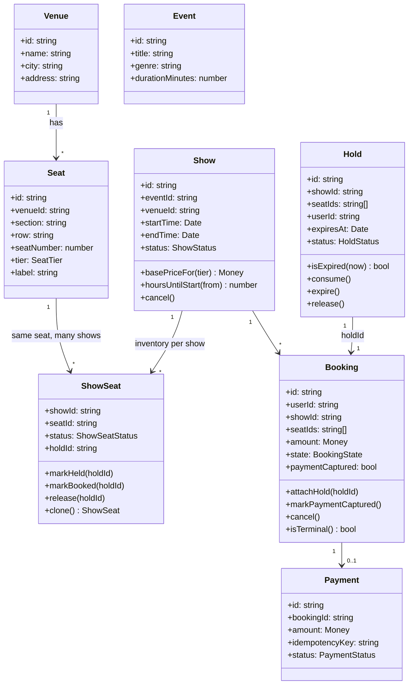
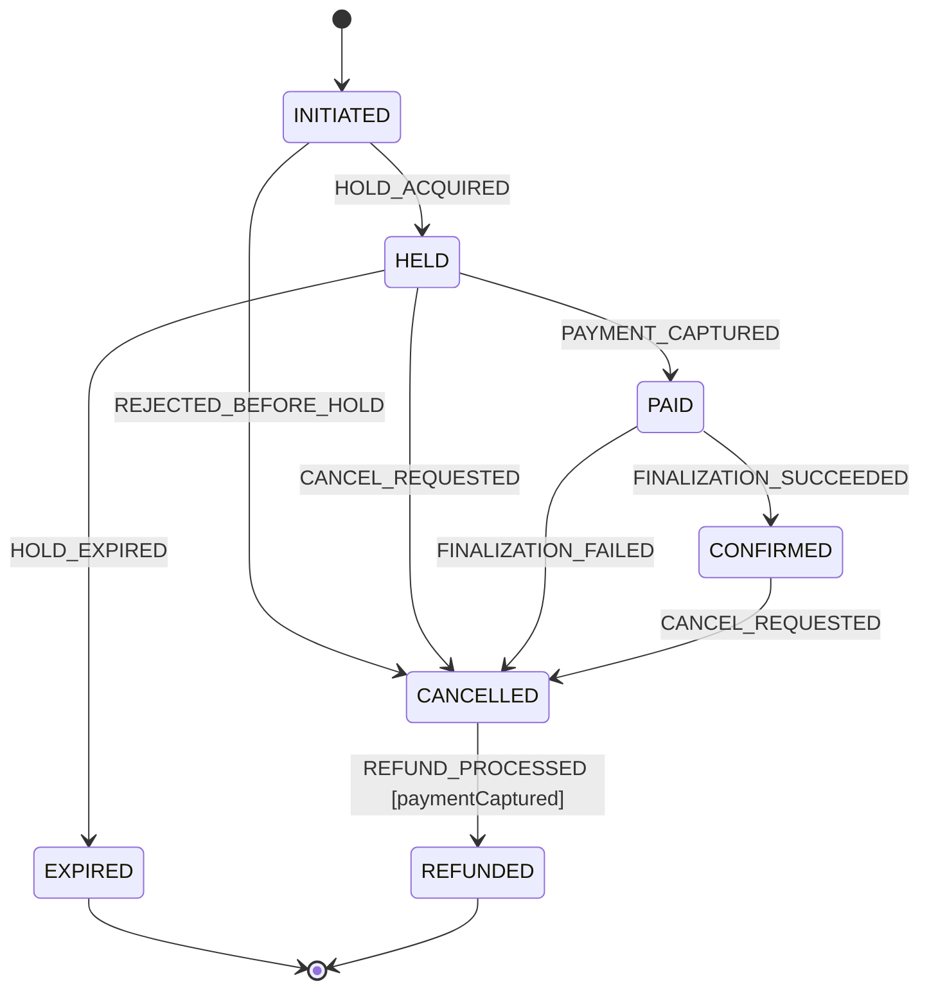
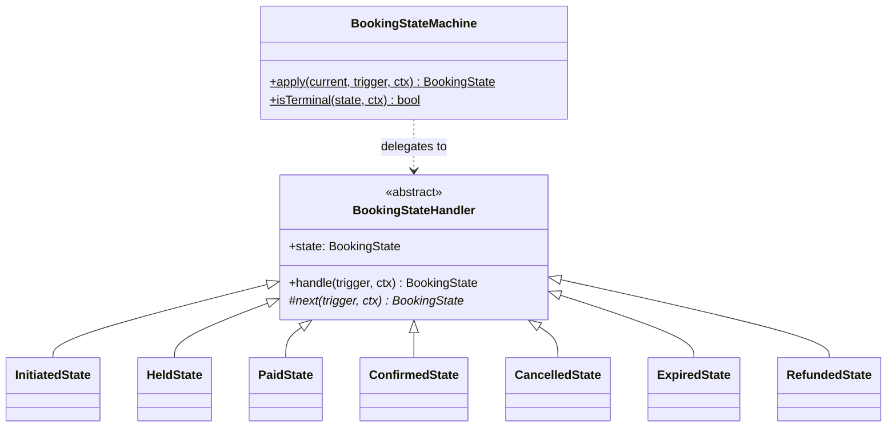
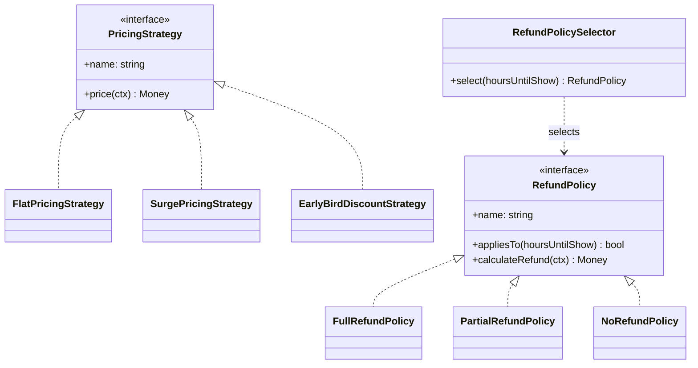
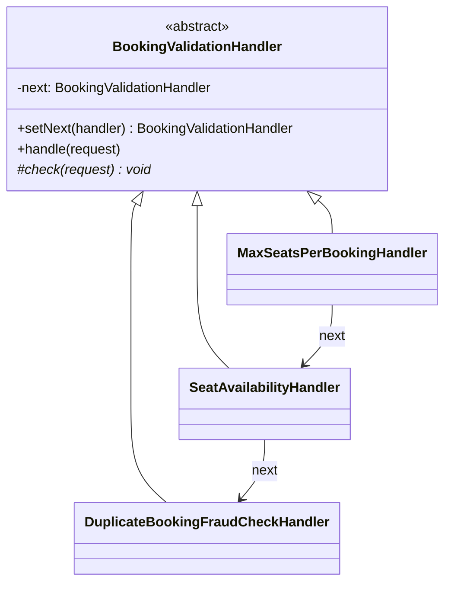
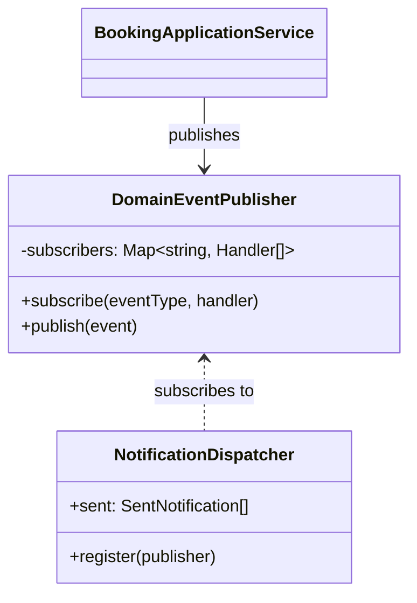
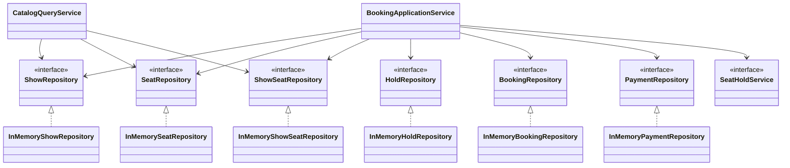

# Low-Level Design

This document grows phase by phase. This revision covers **Phase 1**: the
domain model in [`packages/domain`](../packages/domain), built and tested
with zero framework or database dependency so the business rules can be
verified in isolation before anything about persistence, transport, or
infrastructure is decided.

## Package layout

```
packages/domain/src/
  shared/        Money, sleep
  errors/        DomainError hierarchy
  entities/      Venue, Seat, Event, Show, ShowSeat, Hold, Booking, Payment
  booking/       BookingState enum + BookingStateMachine (State pattern)
  pricing/       PricingStrategy + implementations (Strategy pattern)
  refund/        RefundPolicy + implementations (Strategy pattern)
  validation/    BookingValidationHandler chain (Chain of Responsibility)
  events/        DomainEvent + DomainEventPublisher + NotificationDispatcher (Observer)
  repositories/  Ports (interfaces) + in-memory adapters
  services/      SeatHoldService variants, CatalogQueryService, BookingApplicationService
```

Every module under `entities/`, `booking/`, `pricing/`, `refund/`,
`validation/`, and `events/` is pure TypeScript with no I/O. Everything that
touches state lives behind a `repositories/*Repository` interface, so Phase
2 swaps the in-memory adapters for Prisma-backed ones without changing a
single entity, strategy, or use case.

## Entity relationships



**Why `ShowSeat` is a separate entity from `Seat`:** a physical seat is a
property of the venue and never changes; its *availability* is a property
of one specific show. Modeling availability on `Seat` directly would make
"the same seat, booked for two different showtimes" impossible to
represent. This is also exactly the row that Phase 2's concurrency control
(Redis lock + DB unique constraint) protects.

## State pattern — booking lifecycle





**Design note:** `Booking` stores its state as a plain `BookingState` enum
value (trivially persisted as a DB column), not as a live handler instance.
`BookingStateMachine` is a stateless registry of singleton handler objects
keyed by that enum — a pragmatic middle ground between "true" GoF State
(where the context holds a live state object) and a flat transition table.
Each state class owns exactly its own outgoing edges, so adding a new edge
touches one file instead of a shared switch statement.

`CANCELLED` is deliberately not always terminal: reached from `HELD` it
means "nothing was ever charged," reached from `PAID`/`CONFIRMED` it means
"a refund is owed." The `REFUND_PROCESSED` edge out of `CANCELLED` is
guarded on `paymentCaptured` for exactly this reason — see
`CancelledState` and `BookingStateMachine.isTerminal`.

## Strategy pattern — pricing and refunds



`BookingApplicationService` depends only on the `PricingStrategy`/
`RefundPolicy` interfaces (Dependency Inversion) — which concrete strategy
runs is a constructor-injection decision, not a code change. `Show` never
does pricing math itself (Single Responsibility): it just exposes the
inputs (`basePriceFor`, `hoursUntilStart`) a strategy needs.

## Chain of Responsibility — booking validation



Ordered cheapest/most-likely-to-reject first: seat count needs no repository
reads at all, so it fails a bulk-scalping attempt before the availability
check even runs (see the ordering test in `BookingValidationChain.spec.ts`).
`BookingValidationChain.default()` assembles the chain; nothing about the
handlers themselves hardcodes ordering, so a deployment can swap in a
different chain (e.g. add an OFAC/sanctions check) without touching
existing handlers — Open/Closed in practice.

## Observer pattern — domain events



`BookingApplicationService` publishes `booking.confirmed` /
`booking.cancelled` / `booking.expired` / `payment.failed` /
`refund.processed` without knowing who's listening.
`NotificationDispatcher` is Phase 1's only subscriber (an in-memory stub
that records what it *would* send). Phase 3 adds a second, real subscriber —
an outbox-backed Kafka publisher — with **zero changes to
`BookingApplicationService`**, which is the entire point of coding to this
interface instead of calling a notification service directly.

## Repository + Service layering



Application services depend on interfaces, never on the `InMemory*`
adapters directly — that binding happens at composition time (today, a test
fixture; from Phase 2 onward, a NestJS module's providers). This is what
makes `BookingApplicationService.spec.ts` a real integration test of the
use case logic while still running in milliseconds with no DB.

## Concurrency: proving and fixing double-booking (Phase 1 slice)

`SeatHoldService` has two implementations, both in-memory, on purpose:

- **`NaiveInMemorySeatHoldService`** — a textbook check-then-act: read
  `ShowSeat.status`, do some work, then write. `SeatHoldConcurrency.spec.ts`
  fires 500 concurrent holds at the same seat and shows **every one of them
  succeeds**, because each caller reads its own snapshot of `AVAILABLE`
  before any of them writes.
- **`GuardedInMemorySeatHoldService`** — the same check-then-act, but
  serialized per `(showId, seatId)` via an in-process promise-chained mutex.
  The same 500-caller test shows exactly one success and 499
  `SeatNotAvailableError`s.

This in-process mutex is *not* the production answer — it only serializes
one Node process, not multiple replicas behind a load balancer. It exists
here to isolate and prove the concurrency bug and its fix at the domain
level, cheaply, before Phase 2 introduces the real fix (Redis
`SET NX PX` lock + a DB unique constraint as the final guard) across
multiple processes and a real database. The ADR comparing DB row locking,
optimistic locking, and Redis distributed locks for that Phase 2 decision
lives in `docs/adr/`.

## SOLID notes

- **S**ingle Responsibility: entities hold invariants (`ShowSeat` refuses an
  illegal hold), strategies hold pricing/refund math, the application
  service holds orchestration. None of these overlap.
- **O**pen/Closed: new pricing strategies, refund policies, or validation
  handlers are added as new classes; no existing class is edited to support
  them.
- **L**iskov Substitution: any `PricingStrategy`/`RefundPolicy`/
  `SeatHoldService`/`*Repository` implementation is interchangeable because
  callers only ever depend on the interface, verified directly by running
  the same `BookingApplicationService.spec.ts`-style tests against
  Testcontainers-backed repositories in Phase 2 with no test changes.
- **I**nterface Segregation: repositories are one per aggregate
  (`ShowRepository`, `BookingRepository`, ...) rather than one fat
  `Repository` interface — `CatalogQueryService` only depends on the four
  it actually reads from.
- **D**ependency Inversion: `BookingApplicationService` takes every
  collaborator (repositories, `SeatHoldService`, `PricingStrategy`,
  `RefundPolicySelector`, `DomainEventPublisher`) as a constructor
  parameter. It has no `new` calls to any of them.

---

*Phase 2 adds: Prisma-backed repositories, the Redis/DB seat-hold ADR and
implementation, and Testcontainers integration tests replacing the
in-memory adapters at the wiring level only.*
