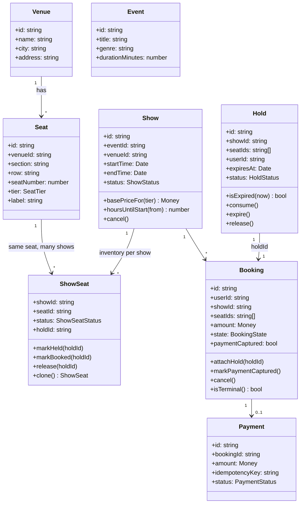
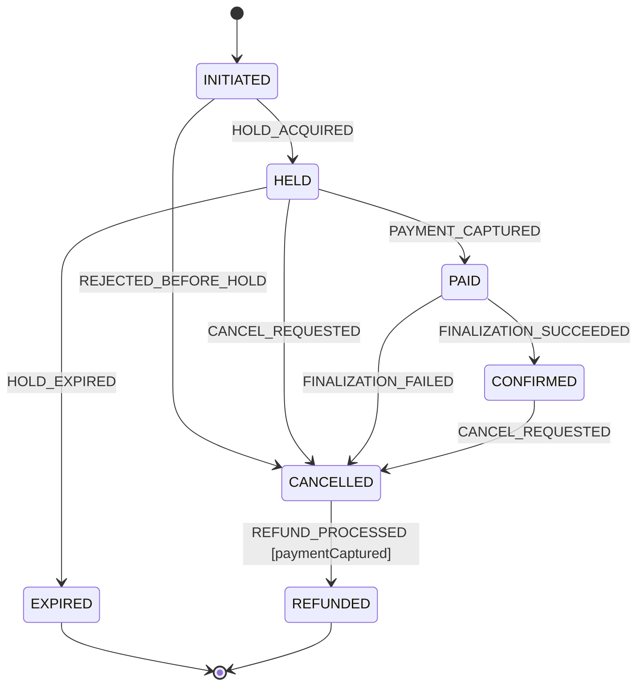
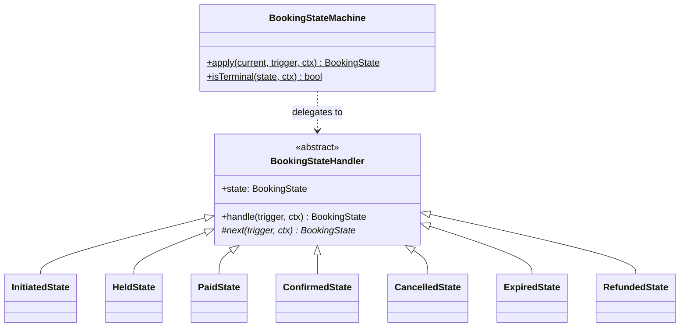
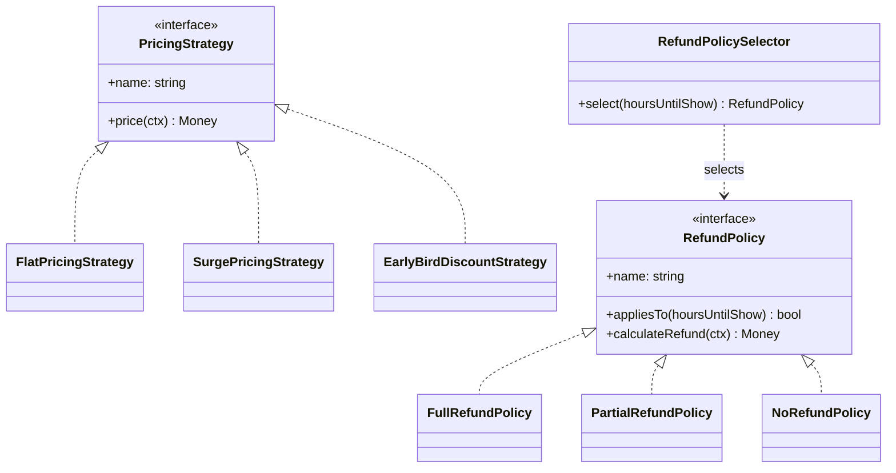
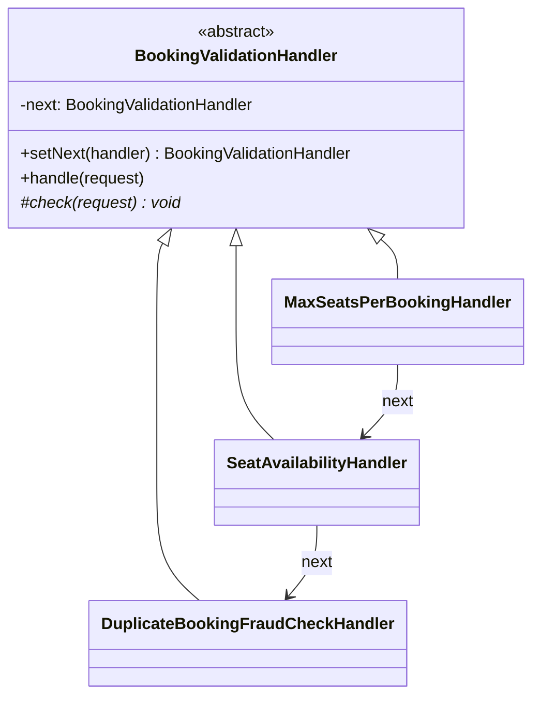
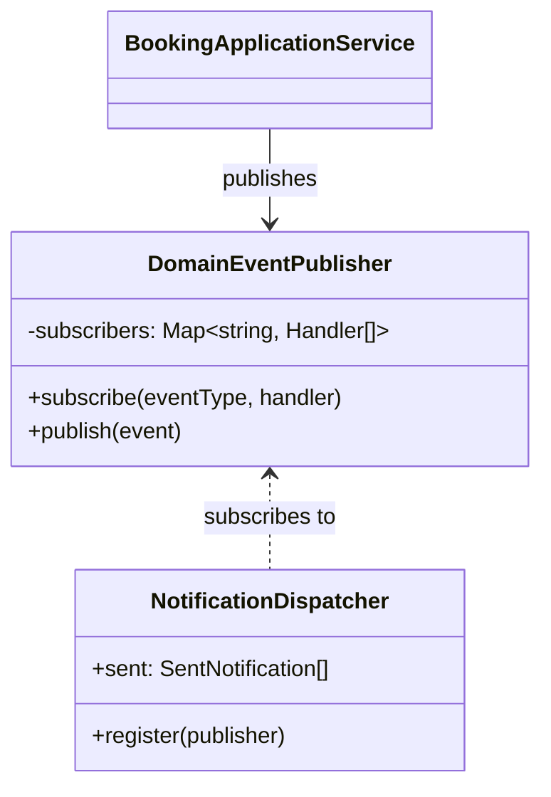
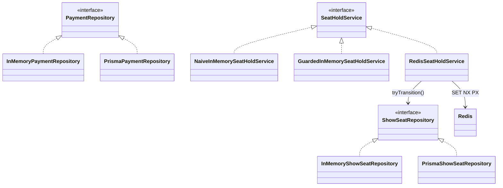
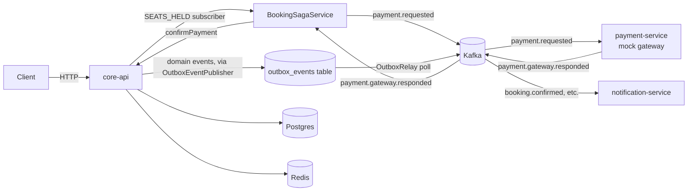
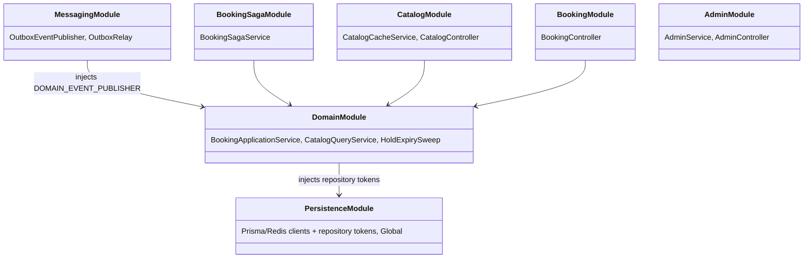
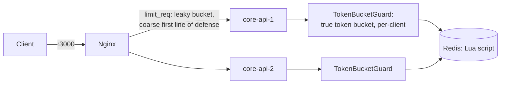

# Low-Level Design

This document grows phase by phase.

- **Phase 1** (below): the domain model in
  [`packages/domain`](../packages/domain), built and tested with zero
  framework or database dependency.
- **Phase 2**: [`packages/persistence`](../packages/persistence) — Prisma
  and Redis-backed implementations of Phase 1's repository ports, plus the
  seat-hold and payment-idempotency concurrency fixes. See
  [ADR 0002](adr/0002-seat-hold-concurrency-control.md) and
  [ADR 0003](adr/0003-payment-idempotency.md) for the design rationale;
  this section covers the resulting package structure and mapping layer.

## Package layout

```
packages/domain/src/
  shared/        Money, sleep
  errors/        DomainError hierarchy
  entities/      Venue, Seat, Event, Show, ShowSeat, Hold, Booking, Payment
  booking/       BookingState enum + BookingStateMachine (State pattern)
  pricing/       PricingStrategy + implementations (Strategy pattern)
  refund/        RefundPolicy + implementations (Strategy pattern)
  validation/    BookingValidationHandler chain (Chain of Responsibility)
  events/        DomainEvent + DomainEventPublisher + NotificationDispatcher (Observer)
  repositories/  Ports (interfaces) + in-memory adapters
  services/      SeatHoldService variants, CatalogQueryService, BookingApplicationService
```

Every module under `entities/`, `booking/`, `pricing/`, `refund/`,
`validation/`, and `events/` is pure TypeScript with no I/O. Everything that
touches state lives behind a `repositories/*Repository` interface, so Phase
2 swaps the in-memory adapters for Prisma-backed ones without changing a
single entity, strategy, or use case.

## Entity relationships



**Why `ShowSeat` is a separate entity from `Seat`:** a physical seat is a
property of the venue and never changes; its *availability* is a property
of one specific show. Modeling availability on `Seat` directly would make
"the same seat, booked for two different showtimes" impossible to
represent. This is also exactly the row that Phase 2's concurrency control
(Redis lock + DB unique constraint) protects.

## State pattern — booking lifecycle





**Design note:** `Booking` stores its state as a plain `BookingState` enum
value (trivially persisted as a DB column), not as a live handler instance.
`BookingStateMachine` is a stateless registry of singleton handler objects
keyed by that enum — a pragmatic middle ground between "true" GoF State
(where the context holds a live state object) and a flat transition table.
Each state class owns exactly its own outgoing edges, so adding a new edge
touches one file instead of a shared switch statement.

`CANCELLED` is deliberately not always terminal: reached from `HELD` it
means "nothing was ever charged," reached from `PAID`/`CONFIRMED` it means
"a refund is owed." The `REFUND_PROCESSED` edge out of `CANCELLED` is
guarded on `paymentCaptured` for exactly this reason — see
`CancelledState` and `BookingStateMachine.isTerminal`.

## Strategy pattern — pricing and refunds



`BookingApplicationService` depends only on the `PricingStrategy`/
`RefundPolicy` interfaces (Dependency Inversion) — which concrete strategy
runs is a constructor-injection decision, not a code change. `Show` never
does pricing math itself (Single Responsibility): it just exposes the
inputs (`basePriceFor`, `hoursUntilStart`) a strategy needs.

## Chain of Responsibility — booking validation



Ordered cheapest/most-likely-to-reject first: seat count needs no repository
reads at all, so it fails a bulk-scalping attempt before the availability
check even runs (see the ordering test in `BookingValidationChain.spec.ts`).
`BookingValidationChain.default()` assembles the chain; nothing about the
handlers themselves hardcodes ordering, so a deployment can swap in a
different chain (e.g. add an OFAC/sanctions check) without touching
existing handlers — Open/Closed in practice.

## Observer pattern — domain events



`BookingApplicationService` publishes `booking.confirmed` /
`booking.cancelled` / `booking.expired` / `payment.failed` /
`refund.processed` without knowing who's listening.
`NotificationDispatcher` is Phase 1's only subscriber (an in-memory stub
that records what it *would* send). Phase 3 adds a second, real subscriber —
an outbox-backed Kafka publisher — with **zero changes to
`BookingApplicationService`**, which is the entire point of coding to this
interface instead of calling a notification service directly.

## Repository + Service layering


Application services depend on interfaces, never on the `InMemory*`
adapters directly — that binding happens at composition time (today, a test
fixture; from Phase 2 onward, a NestJS module's providers). This is what
makes `BookingApplicationService.spec.ts` a real integration test of the
use case logic while still running in milliseconds with no DB.

## Concurrency: proving and fixing double-booking (Phase 1 slice)

`SeatHoldService` has two implementations, both in-memory, on purpose:

- **`NaiveInMemorySeatHoldService`** — a textbook check-then-act: read
  `ShowSeat.status`, do some work, then write. `SeatHoldConcurrency.spec.ts`
  fires 500 concurrent holds at the same seat and shows **every one of them
  succeeds**, because each caller reads its own snapshot of `AVAILABLE`
  before any of them writes.
- **`GuardedInMemorySeatHoldService`** — the same check-then-act, but
  serialized per `(showId, seatId)` via an in-process promise-chained mutex.
  The same 500-caller test shows exactly one success and 499
  `SeatNotAvailableError`s.

This in-process mutex is *not* the production answer — it only serializes
one Node process, not multiple replicas behind a load balancer. It exists
here to isolate and prove the concurrency bug and its fix at the domain
level, cheaply, before Phase 2 introduces the real fix (Redis
`SET NX PX` lock + a DB unique constraint as the final guard) across
multiple processes and a real database. The ADR comparing DB row locking,
optimistic locking, and Redis distributed locks for that Phase 2 decision
lives in `docs/adr/`.

## SOLID notes

- **S**ingle Responsibility: entities hold invariants (`ShowSeat` refuses an
  illegal hold), strategies hold pricing/refund math, the application
  service holds orchestration. None of these overlap.
- **O**pen/Closed: new pricing strategies, refund policies, or validation
  handlers are added as new classes; no existing class is edited to support
  them.
- **L**iskov Substitution: any `PricingStrategy`/`RefundPolicy`/
  `SeatHoldService`/`*Repository` implementation is interchangeable because
  callers only ever depend on the interface, verified directly by running
  the same `BookingApplicationService.spec.ts`-style tests against
  Testcontainers-backed repositories in Phase 2 with no test changes.
- **I**nterface Segregation: repositories are one per aggregate
  (`ShowRepository`, `BookingRepository`, ...) rather than one fat
  `Repository` interface — `CatalogQueryService` only depends on the four
  it actually reads from.
- **D**ependency Inversion: `BookingApplicationService` takes every
  collaborator (repositories, `SeatHoldService`, `PricingStrategy`,
  `RefundPolicySelector`, `DomainEventPublisher`) as a constructor
  parameter. It has no `new` calls to any of them.

---

## Phase 2: persistence and the real concurrency fix

### Package layout

```
packages/persistence/
  prisma/schema.prisma   Postgres schema: enums mirror the domain's literal
                          unions; Hold/Booking store seatIds as a native
                          Postgres text[] rather than a join table
  src/
    prisma/client.ts      PrismaClient factory
    redis/client.ts        ioredis factory
    mappers/money.ts        Money <-> {amountMinorUnits, currency} / JSON
    repositories/          Prisma* implementations of every @etp/domain port
    redis/RedisSeatHoldService.ts   the real SeatHoldService (ADR 0002)
    jobs/HoldExpirySweep.ts        periodic reconciliation for timed-out holds
  test/
    Persistence.integration.spec.ts  Testcontainers: real Postgres + Redis
```

Every class in `repositories/` implements a `@etp/domain` port and nothing
else — `BookingApplicationService`, `CatalogQueryService`, and every domain
entity are completely unaware this package exists. Swapping Phase 1's
in-memory adapters for these was a wiring-only change at the composition
root; zero lines changed in `packages/domain/src/services`.



### The mapping layer

Domain entities construct freely from plain property bags (every optional
reconstruction field — `status`, `holdId`, `updatedAt` — was designed in
Phase 1 exactly so a repository adapter could rebuild an entity from a row
without a second "hydrate" code path). Each `Prisma*Repository` is a thin
translation: read a Prisma row, call one domain constructor; take a domain
entity, spread its fields into a Prisma `upsert`. The one non-trivial
mapping is `Show.basePriceByTier` (a `Record<SeatTier, Money>`) against a
single Postgres `Json` column (`mappers/money.ts`) — deliberately not a
separate price-per-tier table, since the tier list is small, fixed, and
read far more often than written.

### `tryTransition`: the correctness-critical addition to Phase 1's port

Phase 1's `BookingApplicationService` mutated `ShowSeat` via
read-then-save — safe for a single in-memory `Map` (no `await` between
steps), unsafe against a real database shared across processes. Phase 2
adds `ShowSeatRepository.tryTransition()` — one atomic conditional
`UPDATE` — and **Phase 1's entity is retrofitted to use it for every
lifecycle mutation, not just seat acquisition**, closing a race between the
hold-expiry sweep and a payment confirmation landing at the same instant.
Full comparison of DB row-locking vs. optimistic locking vs. Redis
distributed locking, and why the shipped design is a hybrid of the last
two, is in
[ADR 0002](adr/0002-seat-hold-concurrency-control.md).

The identical shape of bug existed in payment idempotency (`claim()` vs.
the Phase 1 `findByIdempotencyKey`-then-save pair) — see
[ADR 0003](adr/0003-payment-idempotency.md).

### Proof

`packages/persistence/test/Persistence.integration.spec.ts` uses
Testcontainers to start real Postgres and Redis containers, applies the
Prisma schema with `prisma db push`, and re-runs the Phase 1 concurrency
proof — 500 concurrent callers racing one seat — against the real stack via
`RedisSeatHoldService` and `PrismaShowSeatRepository`, asserting exactly one
winner. The same suite proves the payment-claim race and a full
initiate → pay → confirm flow end to end.

---

## Phase 3: the running system — core-api, caching, outbox, saga, satellites

Phases 1 and 2 built libraries with no runnable app on top of them. Phase 3
builds the actual system: `services/core-api` (the modular monolith ADR
0001 named), `services/payment-service`, and `services/notification-service`,
plus `packages/messaging` (the outbox + Kafka layer connecting them).

### Service topology



Every arrow into or out of Kafka crosses a process boundary; every other
arrow is a function call within `core-api`. This is deliberate — see ADR
0001 for why catalog/inventory/booking/admin share one process while
payment and notification don't.

### `core-api`'s module graph



Nothing outside `PersistenceModule` imports `@etp/persistence` or
`@prisma/client` directly — every other module depends on `@etp/domain`
port tokens (`SHOW_REPOSITORY`, `SEAT_HOLD_SERVICE`, ...), which is what
let `test/testApp.ts` swap every one of them for a Phase 1 in-memory
adapter and get a fully working, Docker-free test app.

### Caching: cache-aside with stampede protection and event-driven invalidation

`CatalogCacheService` wraps `CatalogQueryService`'s two read paths
(`browse`, `seatMap`) with:

- **Cache-aside**: check Redis, compute-and-populate on miss.
- **Stampede protection**: a Redis `SET NX PX` lock around the "compute"
  step — only the first caller to miss actually queries the database;
  every concurrent caller for the same key waits on the lock instead
  (bounded: falls back to computing itself if the lock holder doesn't
  finish in time, rather than waiting forever on a crashed holder).
- **Invalidation via the Observer pattern, not a direct call**:
  `CatalogCacheService.onModuleInit` subscribes to
  `BOOKING_CONFIRMED`/`BOOKING_CANCELLED`/`BOOKING_EXPIRED`/`PAYMENT_FAILED`
  on the *same* `DomainEventPublisher` `BookingApplicationService` already
  publishes to. `BookingController` has no idea the cache exists.

Proven without Redis or Kafka in
`services/core-api/test/catalog-cache.service.spec.ts` using a hand-rolled
`FakeRedis` — whose own NX-lock bug (fixed during Phase 3) is itself a
small case study in the project's central theme; see the Phase 3a commit
message.

### Async delivery: outbox + Kafka, and the saga

Covered in depth in [ADR 0004](adr/0004-outbox-and-async-delivery.md):
`OutboxEventPublisher` (Observer) durably records every domain event,
`OutboxRelay` polls and forwards to Kafka with retry-then-dead-letter,
and `BookingSagaService` is the thin orchestrator reacting to `SEATS_HELD`
and to the mock gateway's response — reusing `confirmPayment`'s Phase 2
idempotency-claim logic verbatim for the platform's required
duplicate-callback behavior, and relying on `HoldExpirySweep` (not new
saga-specific code) as the compensating action when payment-service never
responds at all.

### Satellite services

`payment-service` and `notification-service` are deliberately plain
Node/TypeScript, not NestJS — a single-purpose Kafka consumer doesn't need
a DI framework, and giving it one would be the "over-engineer" side of the
`don't over-engineer` instruction. Both separate their pure decision logic
(`mockGateway.ts`'s `decideOutcome`; `notificationBuilder.ts`'s
`buildNotification`) from the Kafka wiring in `main.ts`, so the interesting
part is unit-tested without a broker in either service.

### Proof

- `packages/messaging/test/KafkaConsumerRunner.spec.ts` — retry-then-DLQ,
  using hand-rolled fake Kafka consumer/producer objects.
- `packages/messaging/test/OutboxRelay.spec.ts` /
  `OutboxEventPublisher.spec.ts` — the outbox write-then-relay pipeline.
- `packages/persistence/test/HoldExpirySweep.spec.ts` — the saga's
  timeout-based compensation, in isolation.
- `services/core-api/test/booking-saga.e2e.spec.ts` — the full
  initiate → `SEATS_HELD` → `payment.requested` → simulated gateway
  response → `confirmPayment` loop, including the duplicate-callback case.
- `services/payment-service/test`, `services/notification-service/test` —
  each service's pure decision logic.
- [`docs/chaos-test.md`](chaos-test.md) — payment-service killed for a
  booking's entire lifetime, proving the hold TTL is the correct
  compensating mechanism end to end. Written and reviewed; not yet run
  against real infrastructure (see that doc's Status section).

---

## Phase 4: gateway, rate limiting, resilience, API idempotency

Full design rationale in
[ADR 0005](adr/0005-rate-limiting-and-resilience.md); this section covers
the resulting code structure.

### Gateway



`nginx/nginx.conf` load-balances (round robin — `core-api` is stateless by
construction, so replica choice never matters) and applies a coarse
`limit_req`. The platform's actual token-bucket requirement is
`services/core-api/src/common/rate-limit`:
`TokenBucketMath.refillAndConsume` is the pure algorithm,
`InMemoryTokenBucketRateLimiter` and `RedisTokenBucketRateLimiter` (a Lua
script, for the same atomicity reason `tryTransition` is a single SQL
statement) are its two adapters, and `TokenBucketGuard` applies it
globally, keyed per client IP — which requires `main.ts` to set
`trust proxy` so `req.ip` reads `X-Forwarded-For` instead of Nginx's own
container address.

### API idempotency keys

`IdempotencyInterceptor`, wired globally via `APP_INTERCEPTOR`, gives every
POST endpoint opt-in `Idempotency-Key` support with no per-controller code.
It's the same atomic-claim shape as `PaymentRepository.claim()` (ADR
0003): `SET NX` picks one winner, concurrent duplicates wait on the
result. See `test/idempotency.e2e.spec.ts` for the 10-concurrent-identical-
requests proof.

### Resilience

`CircuitBreaker` (hand-rolled state machine: CLOSED → OPEN after N
consecutive failures → HALF_OPEN probe after a cooldown) and
`withRetryBackoff` (exponential backoff, composed *inside* a breaker's
`execute()`, not a replacement for it) guard the two calls in this system
that can actually fail and hang given Phase 3's async architecture:
`BookingSagaService`'s Kafka publish, and `CatalogCacheService`'s Redis
calls. Both fall back to a mechanism the platform already has — hold-
expiry compensation, and direct-to-Postgres reads, respectively — rather
than inventing a new failure mode. See ADR 0005 for why "circuit breaker on
the payment call path" needed reinterpreting once payment processing
became asynchronous.

### Proof

- `TokenBucketMath.spec.ts`, `InMemoryTokenBucketRateLimiter.spec.ts` — the
  algorithm, including a 50-concurrent-request proof that exactly
  `capacity` requests are let through for one key.
- `RedisTokenBucketRateLimiter.spec.ts` — the Lua-script wrapper's
  argument/result plumbing, verified against a fake `eval` running the
  identical `refillAndConsume` function (the actual Lua text itself is
  unverified pending Docker — see the README).
- `TokenBucketGuard.spec.ts`, `rate-limit.e2e.spec.ts` — 429 behavior and
  fail-open-on-Redis-failure, including a dedicated low-capacity app
  instance so this doesn't make unrelated e2e tests flaky.
- `CircuitBreaker.spec.ts`, `retryWithBackoff.spec.ts` — the state machine
  and backoff math in isolation.
- `catalog-cache.service.spec.ts`'s "graceful degradation" describe block,
  `booking-saga.e2e.spec.ts`'s "degrades gracefully" test — the actual
  fallback behavior, using fakes that fail on demand.
- `idempotency.e2e.spec.ts` — replay, independent keys, no-header
  passthrough, and the concurrent-duplicate race.

---

*Phase 5 adds: k6 load tests (flash-sale scenario, with/without caching),
structured logging with correlation IDs, Prometheus metrics, and the full
HLD/ADR/API documentation set.*
